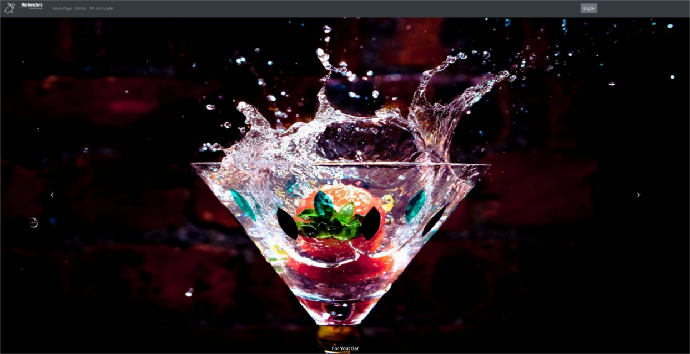

## Bartenders
> The application is designed to provide information about drinks and cocktails for many professional bartenders.

## Table of contents
* [General info](#general-info)
* [Features](#features)
* [Technologies](#technologies)
* [Status](#status)
* [Contact](#contact)

### General info
The application was created to improve bartending work and provide them with a range of recipes for exquisite cocktails and drinks. This makes their work much simpler and more varied because they have a lot to choose from.

## Features

### User authentication and authorization

### View the recipe list for drinks and cocktails with advanced filtering and search by recipe name and ingredient

### Viewing a single recipe and checking its preparation

### The view with the ten most popular drinks on the site

### View of a randomly generated drink for the user

### View with a list of bartending instruments

### Managing favourite recipes by the logged-in user

### Management of drink and cocktail recipes by the administrator

### User management, deletion, granting of administrator privileges

### Application statistics module

## Technologies
* Java SE 12
* Java EE 8
* MySQL
* Hibernate ORM
* FasterXML/Jackson
* REST API
* Docker
* Wildfly
* Maven
* ECMAScript 6
* OAuth 2.0
* SLF4J
* Freemarker
* Bootstrap
* HTML5, CSS3, JS
* jQuery, AJAX
* Google Charts

## Status
Project is: _finished_.

## Contact
Created by a team of students, 2020.

[@Maciej Dzieciuch](https://github.com/MaciejDzieciuch)

[@Kacper Kaczor](https://github.com/kacperkaczor97)

[@Piotr Baczkowski](https://github.com/Erdalien)